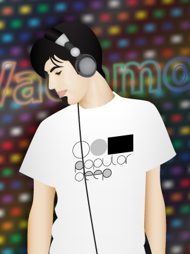

# Шестаков Андрей Николаевич
|  | *адрес*   109451, г. Москва,   ул. Верхние Поля, д. 40, корп. 1 
 *телефон*   +7 926 39 72 888 
 *электронная почта*   Vadamoff@mail.ru |
| :----- | :----- |
| *дата рождения* | 24 октября 1983 |
| *опыт работы* | 12.2019 — наст. вр.   **«Россия 1» («ВГТРК») — «Вести в субботу с Сергеем Брилёвым»**   Ассистент режиссёра телевидениям 
 12.2018 — 01.2020   **«Россия 1» («ВГТРК») — «Вести в 20»**   Ассистент режиссёра телевидениям 
 06.2018 — 01.2019   **«Москва 24» («ВГТРК»)**   Ассистент режиссёра телевидениям 
 05.2018 — 05.2018   **«360°»**   Режиссёр монтажа 
 06.2017 — 10.2017   **«RTVI»**   Режиссёр телевидениям 
 03.2012 — 03.2020   **«Россия 24» («ВГТРК»)**   Ассистент режиссёра телевидениям 
 09.2010 — 03.2012   **Благотворительный фонд реабилитации больных наркоманией**   Руководитель, специалист медиа- и информационных технологий 
 04.2007 — 04.2009   **«Маяк» («ВГТРК»)**   Звукорежиссёр 
 2003 — 03.2007   **«Техносила»**   Продавец-консультант Hi-Fi |
| *образование* | 10.2013 — 06.2016   **Академия Медиаиндустрии**   Мастерская режиссуры документальных программ ТВ   *Дипломный проект посвящен электронной музыке и клубной культуре в России.* 
 09.2003 — 06.2007   **Университет Российской Академии Образования**   Факультет информационных технологий   *Специальность: Математические методы в экономике   Квалификация: Экономист-математик* |
| *дополнительное образование* | Окончил с отличием музыкальную школу по классам флейты и фортепиано.   Окончил курс автомеханика.   Окончил школу ди-джеев. |
| *знание языков* | русский — родной   английский — базовые знания   немецкий — базовые знания |
| *ключевые навыки* | Опытный пользователь ПК;   Знание программ: DJin, Dalet, Final Cut, пакет Sony (Sound Forge, Vegas, DVD Architect), пакет Adobe (Audition, Photoshop, Illustrator, Premiere, After Effects), пакет Steinberg (WaveLab, Cubase), Ableton Live, Native Instruments Traktor и др. софта;   Знание звукового, фото-, видео- и светового оборудования. |
| *личные качества* | Ответственность, исполнительность, честность, инициативность, целеустремленность, энергичность, позитивность, коммуникабельность, артистичность, креативность, заинтересованость в получении новых знаний и повышении квалификации. |
| *обо мне* | Коллекционирую музыку (в основном электронную), хорошо разбираюсь в стилях и направлениях, отслеживаю и анализирую тенденции;   Имею опыт написания и сведения музыки;   Имею опыт выступления в клубах в качестве dj (с разных носителей: винил, cd, digital);   Имею опыт организации и проведения мероприятий (в заведениях и на открытом воздухе);   Являлся одним из создателей музыкальной интернет-радиостанции с круглосуточным вещанием и ежедневными живыми программами, гостями которой были dj’s Лосев, Сергей Санчес, Тим Сводник и др. В течение 7 лет вел авторскую программу. Позже записывал еженедельные подкасты (ознакомиться можно на mixcloud: [Vadamoff](https://www.mixcloud.com/Vadamoff "Vadamoff @ mixcloud") и [[ex]Droid](https://www.mixcloud.com/exDroid "[ex]Droid @ mixcloud"). |
